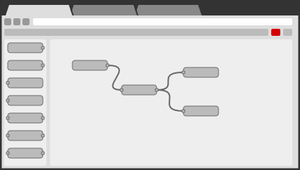

# Node-RED
Wikipedia [Node-RED ](https://de.wikipedia.org/wiki/Node-RED)  

<a href="https://nodered.org/">
 
</a> &nbsp;&nbsp;&nbsp;&nbsp;
<a href="https://nodered.org/">
 
</a> &nbsp;&nbsp;&nbsp;&nbsp;
<a href="https://nodered.org/">
 
</a>  

[Homepage](https://nodered.org/)

## Installation
* Getting started [Raspberry Pi](https://nodered.org/docs/getting-started/raspberrypi)  
  **Hinweis:** lokale Installation ohne npm wurde verwendet ```sudo apt-get install nodered```
* Getting started [Windows](https://nodered.org/docs/getting-started/windows#running-on-windows) - installed on Acer  
  **Hinweis:** Command-Window: ```node-red```  - Chrome browser: [http://127.0.0.1:1880/](http://127.0.0.1:1880/) - Details see [NR](https://github.com/griemide/NR/)

### Upgrading Node-RED
```sudo npm install -g --unsafe-perm node-red```  
Using upgrade-script see [Getting started on Raspberry Pi](https://nodered.org/docs/getting-started/raspberrypi) - Retrieved 2021-04-27  
```bash <(curl -sL https://raw.githubusercontent.com/node-red/linux-installers/master/deb/update-nodejs-and-nodered)```  
Upgrade [example](images/Node.RED_Upgrade.jpg) and [logfile](images/nodered-install.log) - upgrated 2021-04-28  


### Restart Node-RED
```node-red-stop && node-red-start```

### Backup
Back up following files within **```/home/pi/.node-red```** by using sftp service (e.g. **FileZilla**):  
* flow.json, 
* flows_cred.json,
* settings.js, 
* package.json, and 
* package-lock.json.

Then, to restore them, copy those files back over, open the folder in a terminal, and type **```npm install```**.   
That should get everything right back to where it was.  

---
Raspberry [Pi Projekte](https://github.com/griemide/RPi) using Node-Red.

---

## Documentation

[Node-RED Library](https://flows.nodered.org/)  
[Node-RED Cookbook](https://cookbook.nodered.org/)  

[Node RED Programming Guide](http://noderedguide.com/)

[Node-RED YouTube](https://www.youtube.com/channel/UCQaB8NXBEPod7Ab8PPCLLAA) - Official  
[Node-RED YouTube](https://www.youtube.com/watch?v=ktGprvHi5jU&t=59s) - Haus Automation (german)  
[Node-RED YouTube](https://www.youtube.com/watch?v=wX1_6W2GmNI) - Dashboard Tutoriel with CSS style handling  

[Changing Favicons for node-red Dashboards](https://gist.github.com/mohnen/6923d5eb2e4547bb7e5bd90546d2ee80)

---
## Public Examples
[Public Flows](flows/readme.md)  
[Public Subflows](subflows/readme.md)  

---
## Private Projects
[Private Flows](https://github.com/griemide/NR/)  

---
[]()  
[]()  
[]()  
