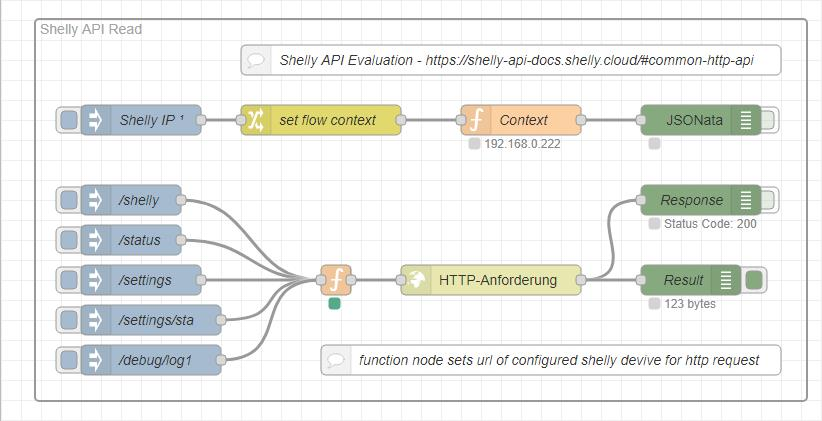
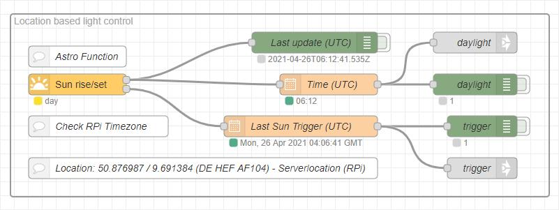

# Node-Red Public Flow Snippets

## Context
  

## RPi CPU Temperature & Homekit
  

## MAC address
  

## Shelly
  

## Shelly API
  

## Webpage
  

## Sun rise/set (astro)
  

## Backup (manually)
See private flow example for Raspberry Pi OS and Windows 10 [here](https://github.com/griemide/NR/blob/main/flows/readme.md)  
   

## Remote-RED (iOS App)
See [Remote-RED Homepage](https://www.remote-red.com/de/home/) and [iOS AppStore](https://apps.apple.com/de/app/remote-red/id1529777665) for details.  
   

