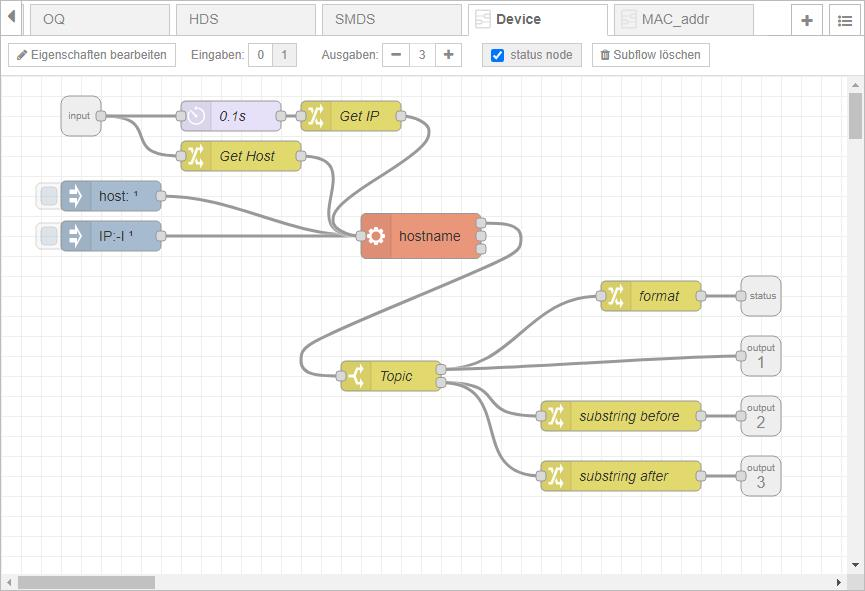

# Device

The subflow is designed to provide the following information on the target device (e.g. Raspberry Pi Zero W):  
* Hostname
* IPv4 address
* IPv6 address

Each output data will be presented as String.
At deploy the subflow will be triggerd automatically.  
The subflow can also be triggered at any time via message (any content allowed).
Device-Node does not contain any Enviromental Variable.

## Design
Note: click onto picture to see corresponding subflow as formatted json.
  
