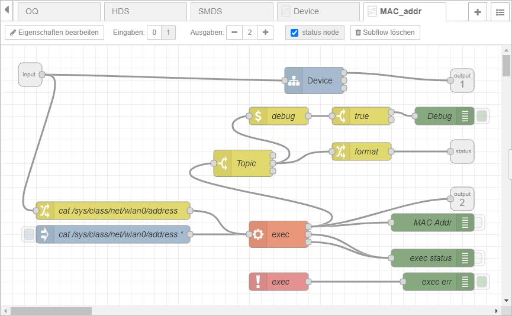

# MAC_addr

The subflow is designed to provide the following information of the target device (e.g. Raspberry Pi Zero W).  
Output:
1. Hostname (by using subflow 'Device')
2. MAC address

Status: 
* MAC address 

Each output data will be presented as String.
At deploy the subflow will be triggerd automatically.  
The subflow can also be triggered at any time via message (any content allowed).
Device-Node does contain 'debug' as Enviromental Variable.
When set to true additional debug information (e.g. exec return code) will be presented.

## Design
Note: click onto picture to see corresponding subflow as formatted json.
  
