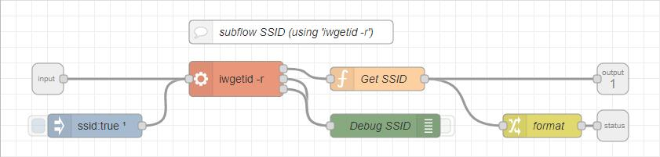

## SSID

The subflow is designed to provide the following information of the target device (e.g. Raspberry Pi Zero W).  
Output:
1. SSID

Status: 
* SSID 

Each output data will be presented as String.
At deploy the subflow will be triggerd automatically afer a preconfigured time of 10 seconds to allow proper Wifi setup.  
The subflow can also be triggered at any time via message (any content allowed).
Device-Node does not contain any Enviromental Variable.

## Design
Note: click onto picture to see corresponding subflow as formatted json.
  
