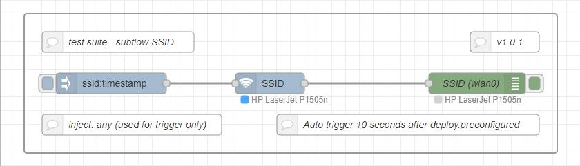

# Subflows

Node-RED - User Guide [Subflows](https://nodered.org/docs/user-guide/editor/workspace/subflows)   
Node-RED - User Guide [environment variables](https://nodered.org/docs/user-guide/environment-variables)  

## Device
The subflow is designed to provide the following information of the target device: **Hostname, IPv4 address, IPv6 address**  
Note: click onto picture to see corresponding subflow design. Test Suite [flow](Subflow_Device_2021-03-05_flows.json)
  

## MAC_addr
The subflow is designed to provide the following information of the target device: **Hostname, IPv4 address, IPv6 address**  
Note: click onto picture to see corresponding subflow design. Test Suite [flow](Sub-Subflow_MAC-addr_2021-03-06_flows.json)
  

## SSID
The subflow is designed to provide the following information of the target device: **SSID**  
Note: click onto picture to see corresponding subflow design. Test Suite [flow](Subflow_SSID_2021-03-09_flows.json)
  

## Toggle
The subflow is designed that any input trigger the output which **toggles** between true and false.  
Test Suite [flow](Subflow_Toggle_2021-03-10_flows.json)  

  
  
  
  
